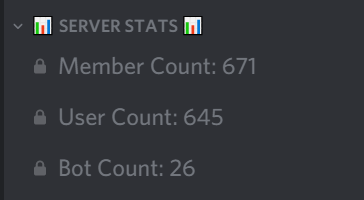

# Getting Started

## Setup

1. Invite the bot with this [link](https://discordapp.com/api/oauth2/authorize?client_id=432533456807919639&permissions=8&scope=bot). Be sure to give it the `Administrator` permission.
2. Type `m!setup`.

With simply two steps, the setup for Member Count is done.

### Options

You can enable and disable certain counters with the following commands.

Member count: `m!counter members <on/off>`  
User count: `m!counter users <on/off>`  
Bot count: `m!counter bots <on/off>`  
Role count: `m!counter roles <on/off>`  
Channel count: `m!counter channels <on/off>`  
Members in role count: `m!counter role <add/remove> <role>`  
Online count: `m!counter online <on/off>`  
Offline count: `m!counter offline <on/off>`

More information on this can be found on the [commands](commands-extended.md) page.

## Support

If you have issues with the bot, check out the various pages in this documentation first. Feel free to get additional help on our [support server](https://discord.gg/dWMgWWw) if you do not find a solution here.

## Suggestions

To make suggestions, head down to our [support server](https://discord.gg/dWMgWWw) and share your suggestions in the `#suggestions` channel.

